<p align="center">
  
</p>

<p align="center">
  <a href="./README.zh-CN.md">中文</a>
  &nbsp;·&nbsp;
  <a href="./docs/GUIDE.md">Guide</a>
  &nbsp;·&nbsp;
  <a href="./docs/SPEC.md">Spec</a>
  &nbsp;·&nbsp;
  <a href="./docs/PROJECT.md">Project</a>
</p>

> **Reasonix Hermes** is an extended fork of
> [esengine/deepseek-reasonix](https://github.com/esengine/deepseek-reasonix)
> (synced to v1.8.0), the DeepSeek-native AI coding agent. We build on
> upstream's config-driven, plugin-driven Go core and add a Discord bot,
> MCP bridge server, Hindsight memory server, curated skill registry,
> native hook runner, and portable mode — everything an agent ecosystem
> needs to connect, remember, and collaborate.

<br/>

<h3 align="center">A DeepSeek-native AI coding agent — forked and extended for the community.</h3>
<p align="center">Single Go binary. Config-driven. Plugin-driven. Tuned for DeepSeek's prefix cache so token costs stay low across long sessions.</p>

<br/>

## What Hermes adds

Hermes keeps upstream's core — the agent loop, providers, tools, permissions,
plugin system, desktop app — and layers on cross-agent connectivity and
persistent memory:

| Addition | What it does |
|----------|-------------|
| **Discord bot** | `/goal <objective>` autonomous loop, `/model flash\|pro\|mimo` per-session switching, slash commands for approval/deny/ask, multi-platform gateway |
| **MCP bridge server** | 6 tools (`reasonix_run`, `doctor`, `plan`, `orchestrate`, `get_skill`, `get_skills`) — connect Claude Code, Codex, or any MCP client to Reasonix over stdio or HTTP |
| **Hindsight memory** | 3 tools (`retain`, `recall`, `reflect`) — cross-session persistent memory with SQLite + file backends, TTL/importance decay, and TF-IDF vector search |
| **Skills hub** | 17 curated community skills (debugging, security audit, code review, refactoring, frontend builder, migration assistant, adversarial review…) — frontmatter playbooks with `runAs` and `allowedTools` |
| **Native hook runner** | Zero-dependency Go binary for PreToolUse/Stop hooks — replaces shell scripts, POSTs retain/reflect to the memory server |
| **Portable mode** | `REASONIX_PORTABLE=1` redirects all data (config, sessions, cache, memory, skills) to `<binary_dir>/.reasonix/` — run from a USB drive or air-gapped machine |

### Desktop Hermes enrichment

The desktop app (Wails + React 19) has been enriched with 19 Hermes-specific features:

| Feature | What it does |
|---------|-------------|
| **Hermes accent theme** | 7th theme style — caduceus gold (#d4a853) with warm dark surfaces and teal highlights |
| **Live data push** | Wails event loop replaces 5s frontend polling — all dashboard data pushed from Go |
| **Token sparkline chart** | Per-turn stacked bar chart (prompt + completion) with cache hit-rate and peak tokens |
| **Compaction timeline** | Timeline panel showing auto/manual compactions with trigger, message count, and summary |
| **Checkpoint file preview** | Expandable per-turn file list with pre-edit content preview (up to 500 chars) |
| **Write Mode** | Split-pane Markdown editor with file browser, live preview, Cmd+S save, new file creation |
| **Memory fact graph** | Facts clustered by type with color-coded badges (user/project/feedback/reference) |
| **Cache economy gauge** | Session-wide cache hit-rate badge |
| **Hindsight memory dashboard** | Facts, docs, and scopes from the auto-memory store |
| **Discord bot monitor** | Live online/offline status and session count in StatusBar |
| **Goal progress widget** | Active goal bar with turn/block status badges |
| **Skills hub browser** | 17 skills with search and category filter |
| **Sub-agent task tree** | Indented tree with status badges (running/done/failed) |
| **Constitution health check** | Rules viewer with JSON template from .reasonix/constitution.json |
| **StatusBar compact widgets** | Cache% gauge and Discord dot in the bottom bar |
| **Hotbar** | 7 keyboard digit shortcuts (Ctrl+1-7) for palette/workspace/new/history/dock/sidebar/settings |
| **Profiles** | Named profile switching — fast/cheap vs. deep reasoning with model/effort/mode overrides |

Full reference: **[Hermes Master Guide](./docs/HERMES-GUIDE.md)** — 19 sections covering all upstream + Hermes features.

### CLI TUI Hermes enrichment

The terminal chat UI has been enhanced:

- ⚚ **Pinned header** — REASONIX-HERMES branding visible above the transcript at all times
- **Bottom status counters** — turns, messages, goal progress, and memory facts always visible
- **`/stats` sparkline** — Unicode block character (▁▂▃▄▅▆▇█) token bar chart per turn
- **`/stats` compaction log** — each compaction pass with trigger, message count, and summary
- **`/stats` memory facts** — fact list with name and title
- **`/stats` goal progress** — status, turns, and blocks when a goal is active
- **`/write <file>`** — opens .md files in $EDITOR for Write Mode
- **`/publish` / `/cost`** — session transcript export (HTML/JSON) and cost summary

### Expansion packs (v1.7.0+)

| Feature | What it does |
|---------|-------------|
| **Telegram bot adapter** | Long-polling Telegram adapter implementing `bot.Adapter` — DMs, groups, supergroups, media extraction, message splitting. Config at `[bot.telegram]`. |
| **LINE bot adapter** | Webhook-based LINE Messaging API adapter implementing `bot.Adapter` — handles text messages via reply API, paragraph-aware splitting. Runs local HTTP server for webhook events. Config at `[bot.line]`. |
| **Self-improving skill loops** | `internal/learn/` — observes turn patterns (edit→test, write→build), detects repeated sequences, builds reflection prompts for automated SKILL.md generation. Config at `[learn]`. |
| **Agent-to-agent MCP mesh** | `internal/mesh/` — peer delegation, broadcast, council mode (N peers → consensus synthesis). HTTP JSON-RPC transport with bearer auth. Config at `[mesh]` with `[[mesh.peers]]`. |
| **Live collaboration** | `internal/collab/` — WebSocket hub for real-time session sharing between Reasonix instances. Subscribe/broadcast/steer protocol. Config at `[collab]`. |
| **Schedule dashboard** | Cron-driven automated agent tasks with next-run timers and result ring (desktop widget). Config at `[[schedule.tasks]]`. |
| **Session publishing** | Export session transcripts as self-contained HTML (inline CSS, syntax highlighting) or JSON. Desktop widget with one-click download+clipboard. |
| **PR review action** | GitHub Action: on PR open/sync → fetches diff → runs Reasonix review with 6-dimension prompt (correctness, CI, constraints, security, trustworthiness, completeness) → posts comment. |
| **Helm chart + docker-compose** | One-command deploy to Kubernetes or single-node $5 VPS. `deploy/helm/reasonix/` (7-file chart) + `deploy/docker-compose.yml`. |

<br/>

## Upstream foundation

Reasonix itself is a **config- and plugin-driven coding agent** — a single
static Go binary. No hardcoded models. Every provider, tool, and plugin is
declared in `reasonix.toml`. Built-in tools self-register at compile time;
external MCP servers plug in at runtime over stdio or HTTP.

- **Multi-model.** DeepSeek V4 Flash/Pro and MiMo v2.5 Pro ship as presets.
  Any OpenAI-compatible endpoint is a config entry. Optionally run a planner +
  executor in separate, cache-stable sessions.
- **Permission gating.** Per-call allow/ask/deny rules — `Bash(go test:*)`,
  `Edit(docs/**)`, glob matching. Interactive approval in chat, desktop, and
  Discord.
- **Desktop app.** Wails v2 shell with React 19 + TypeScript frontend —
  themable workspace, file tree, checkpoints/rewind, bot gateway.
- **Zero-friction.** `CGO_ENABLED=0` single binary; cross-compile to six
  targets with one command.

See the [Guide](./docs/GUIDE.md), [Spec](./docs/SPEC.md), and [Hermes Guide](./docs/HERMES-GUIDE.md) for the full picture.

<br/>

## Install

### One-line (npm)

```sh
npm i -g reasonix-hermes
```

This pulls the prebuilt binary for your platform and adds `reasonix-hermes`
(and `reasonix`) to your PATH.

### Build from source

```sh
git clone https://github.com/aliatx2017/reasonix-hermes.git
cd reasonix-hermes

# Core CLI
go build -o bin/reasonix ./cmd/reasonix

# Hermes services
go build -o bin/reasonix-mcpbridge  ./cmd/reasonix-mcpbridge   # MCP bridge (6 tools)
go build -o bin/reasonix-memory     ./cmd/reasonix-memoryserver # Hindsight memory
go build -o bin/reasonix-bot        ./bot                       # Discord, Telegram, LINE bot
go build -o bin/reasonix-hooks      ./cmd/reasonix-hooks        # Hook runner
go build -o bin/reasonix-review     ./cmd/reasonix-pr-review    # PR review CLI

# Desktop app (Wails + React 19)
cd desktop && wails build -o ../bin/reasonix-desktop
```

### Install the 17-skill community registry

```sh
./bin/reasonix install-source install \
  --source https://github.com/aliatx2017/reasonix-hermes/tree/main/skills-hub/skills
```

<br/>

## Quick start

```sh
./bin/reasonix setup                      # config wizard → ./reasonix.toml
export DEEPSEEK_API_KEY=sk-...            # or put it in .env
./bin/reasonix chat                       # start a session

# Run a one-shot task
./bin/reasonix run "add unit tests for the auth module"

# Start the MCP bridge (expose Reasonix to other agents)
./bin/reasonix-mcpbridge --http --port 9090

# Start the memory server
./bin/reasonix-memory --backend sqlite --http --port 8080

# Run the Discord/Telegram bot
export DISCORD_BOT_TOKEN="..."
./bin/reasonix-bot
```

<br/>

## Configuration

A minimal `reasonix.toml` — one provider and a default model — is enough to start:

```toml
default_model = "deepseek-flash"

[[providers]]
name        = "deepseek-flash"
kind        = "openai"
base_url    = "https://api.deepseek.com"
model       = "deepseek-v4-flash"
api_key_env = "DEEPSEEK_API_KEY"
```

Resolution order is **flag > `./reasonix.toml` > `~/.config/reasonix/config.toml` >
built-in defaults**. Secrets come from the environment via `api_key_env` — never
written to config files.

### Memory server as an MCP plugin

```toml
[[plugins]]
name    = "hindsight"
command = "./bin/reasonix-memory"
args    = ["--backend", "sqlite"]
```

### Discord bot config

```toml
[bot]
enabled = true
model   = "deepseek-flash"

[bot.allowlist]
enabled       = true
discord_users = ["123456789"]
discord_groups = ["987654321"]

[bot.discord]
token_env    = "DISCORD_BOT_TOKEN"
server_id    = "123456789"
allow_dms    = true
```

Full reference: **[Guide](./docs/GUIDE.md)** covers permissions, sandbox, plugins
(MCP), slash commands, `@` references, two-model collaboration, hooks, and memory.

<br/>

## Documentation

| Doc | What |
|-----|------|
| **[Guide](./docs/GUIDE.md)** | Configuration, permissions & sandbox, plugins (MCP), slash commands, two-model collaboration |
| **[Spec](./docs/SPEC.md)** | Engineering contract — architecture, registries, data types, and design principles |
| **[Hermes Guide](./docs/HERMES-GUIDE.md)** | Comprehensive Hermes feature guide — 20+ sections covering all extensions |
| **[Project](./docs/PROJECT.md)** | Hermes fork architecture, commands, customizations, and contributor notes |
| **[Desktop App](./docs/DESKTOP.md)** | Wails desktop app — Hermes dashboard, write mode, bot connections, live data |
| **[Bot Guide](./docs/BOT_GUIDE.md)** | Connect Discord, Telegram, LINE, Slack, Feishu, WeChat, QQ bots |
| **[Marketplace](./docs/MARKETPLACE.md)** | Community skill registry + LobeHub sync (360k+ skills) |
| **[Constitution](./docs/CONSTITUTION.md)** | Project invariants — principles, constraints, and code-level rules |
| **[Session Eval](./docs/EVAL.md)** | Compare two agent sessions for eval-driven development |
| **[Migrating from 0.x](./docs/MIGRATING.md)** | Moving from legacy TypeScript releases to the 1.0 Go rewrite |
| **[Checkpoints & rewind](./docs/CHECKPOINTS.md)** | Snapshot-based edit safety net (Esc-Esc / `/rewind`) |
| **[Changelog](./docs/CHANGELOG-HERMES.md)** | Hermes fork milestones, expansion packs, bot platforms |
| **[Ecosystem Reference](./reasonix-deepseek-ecosystem-2026.md)** | Full landscape: MCP bridges, skills, desktop, IDE, forks, protocols |

<br/>

## Relationship to upstream

Hermes tracks [esengine/deepseek-reasonix](https://github.com/esengine/deepseek-reasonix)
(`main-v2` branch) as its upstream. We merge upstream releases into our `main`
branch and layer our additions on top:

```sh
git fetch upstream
git merge upstream/main-v2
```

Our custom code lives in `cmd/reasonix-*`, `internal/bot/`, `internal/learn/`,
`internal/mesh/`, `internal/collab/`, `internal/compress/`,
`internal/scheduler/`, `internal/publish/`, `pkg/`, `bot/`, `deploy/`,
`skills-hub/`, and the `desktop/hermes_dashboard.go` + React hermes components.
We do not modify the upstream engine (`internal/agent`, `internal/provider`,
`internal/tool`, `internal/plugin`, `internal/skill`, `internal/lsp`, etc.)
except for the shared `internal/bot/` gateway and `internal/control/` getters
used by our adapters and desktop dashboard.

For the full upstream feature set — desktop app (Wails + React 19), bot gateway
(Feishu/WeChat/QQ), ACP sessions, PDF extraction, themeable workspace — see the
[upstream README](https://github.com/esengine/deepseek-reasonix).

<br/>

## Acknowledgments

Hermes is built on [esengine/deepseek-reasonix](https://github.com/esengine/deepseek-reasonix) —
a community effort by [dozens of
contributors](https://github.com/esengine/DeepSeek-Reasonix/graphs/contributors).
All credit for the core engine, provider abstraction, tool system, permission
layer, plugin framework, desktop app, and the original vision belongs to the
upstream team.

<p align="center">
  <a href="https://github.com/esengine/DeepSeek-Reasonix/graphs/contributors">
    
  </a>
</p>

<br/>

---
<p align="center">
  <sub>MIT — see <a href="./LICENSE">LICENSE</a></sub>
  <br/>
  <sub>Hermes extras built by <a href="https://github.com/aliatx2017">aliatx2017</a> · upstream by <a href="https://github.com/esengine/DeepSeek-Reasonix">esengine/DeepSeek-Reasonix</a></sub>
</p>
